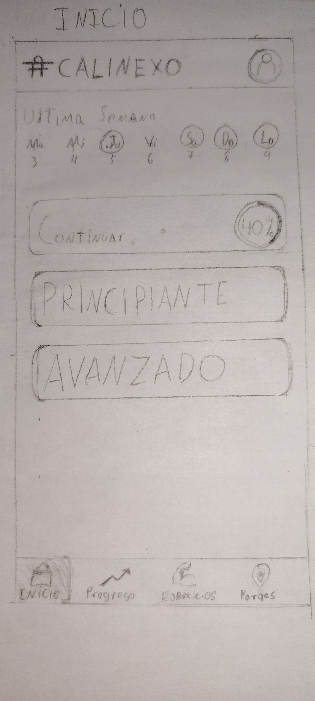
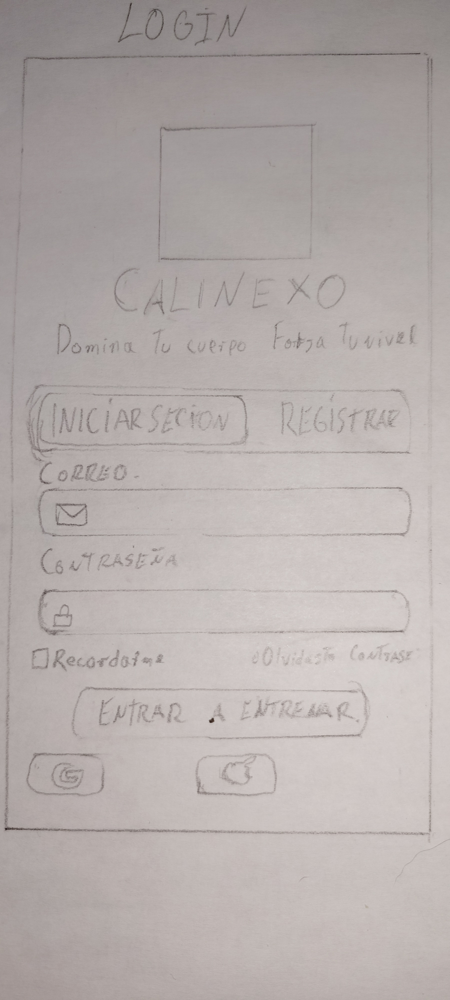
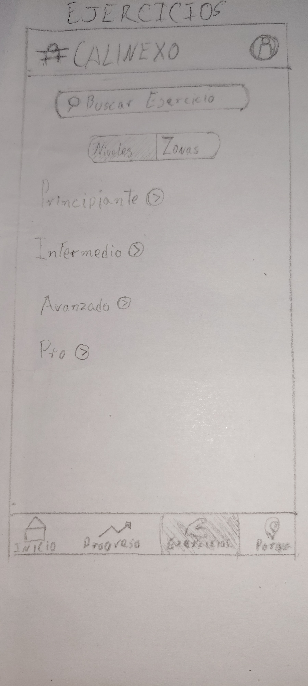
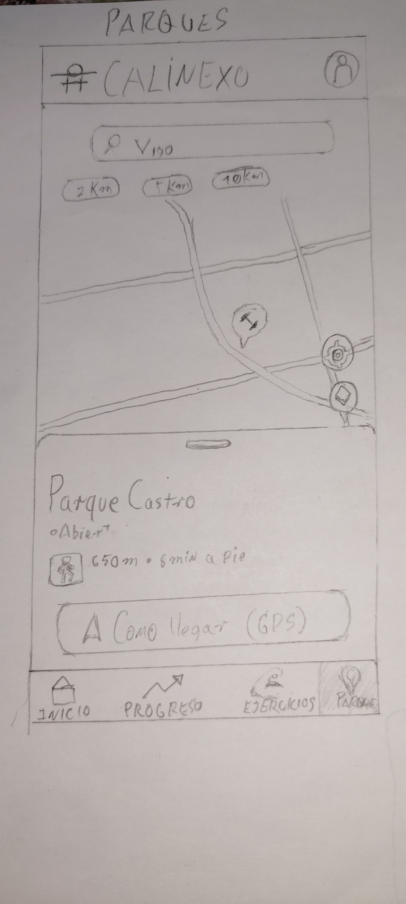

# 0 · Datos

**Nombre de la app:** CaliNexo *(nombre provisional)*  
**Autor/a:** Kevin Mendez Rodriguez 
**Fecha:** 28/09/2026

# 1 · La idea en una frase

Una aplicación que permite a personas que practican o quieren empezar a practicar calistenia aprender ejercicios mediante progresiones por niveles, consultar cómo realizarlos y registrar su avance.

# 2 · El problema

La aplicación pretende facilitar el aprendizaje de la calistenia, especialmente para personas principiantes que no saben qué ejercicios realizar ni en qué orden deberían aprenderlos.

Actualmente existe mucha información sobre calistenia en vídeos, redes sociales y páginas web, pero suele estar repartida entre distintas fuentes y no siempre queda claro qué ejercicios son adecuados para cada nivel o qué progresiones deberían seguirse antes de intentar movimientos más difíciles.

La aplicación organizará los ejercicios de forma estructurada por niveles y progresiones, permitiendo consultar cómo se realiza cada ejercicio y registrar cuáles ha conseguido completar la persona usuaria.

De esta manera, el usuario podrá tener una guía sencilla que le permita saber desde dónde empezar y cómo continuar avanzando.

# 3 · Personas usuarias

Un ejemplo de usuario sería **Álex, de 20 años**, que quiere empezar a practicar calistenia pero tiene poca experiencia y no sabe qué ejercicios debería aprender primero.

Utiliza habitualmente el móvil y entrenaría principalmente en casa o en parques de calistenia. Abriría la aplicación antes o durante sus entrenamientos para consultar qué ejercicio le corresponde practicar, ver cómo se realiza y comprobar cuáles ha conseguido completar.

También podría utilizarla una persona con cierta experiencia que quiera seguir una progresión para conseguir movimientos más difíciles.

Si la aplicación falla ocasionalmente sería una molestia, pero no supondría un problema grave. Sin embargo, sería importante que el progreso registrado por el usuario no se perdiera.

# 4 · Funcionalidades

## Imprescindibles

| # | Funcionalidad |
|---|---|
| F1 | Consultar ejercicios de calistenia organizados por niveles y progresiones de dificultad. |
| F2 | Consultar la información de cada ejercicio, incluyendo instrucciones para realizarlo, nivel de dificultad, requisitos previos y contenido visual que ayude a entender su ejecución. |
| F3 | Registrar los ejercicios que el usuario ha conseguido completar para poder consultar su progreso. |
| F4 | Localizar de forma provisional parques o zonas de calistenia cercanas utilizando la ubicación del dispositivo. |

## Opcionales

| # | Funcionalidad |
|---|---|
| O1 | Guardar ejercicios como favoritos para encontrarlos rápidamente. |
| O2 | Crear pequeñas rutinas seleccionando varios ejercicios disponibles en la aplicación. |

# 5 · Pantallas

| Pantalla | Para qué sirve | Se llega desde |
|---|---|---|
| **Inicio / Progresiones** | Mostrar los diferentes niveles y progresiones de calistenia y permitir seleccionar los ejercicios disponibles. | Arranque |
| **Detalle del ejercicio** | Mostrar el nombre, dificultad, explicación, requisitos y contenido visual del ejercicio. También permitirá marcarlo como completado. | Inicio / Progresiones |
| **Mi progreso** | Mostrar los ejercicios que el usuario ha completado y permitir consultar cuánto ha avanzado dentro de las diferentes progresiones. | Inicio |
| **Parques cercanos** | Utilizar la ubicación del dispositivo para consultar zonas o parques de calistenia próximos al usuario. | Inicio |

# 6 · Bocetos

### Notas:

**Nota1:** El header y el footer son fijos en todas las pantallas exepto en la de login
**Nota2:** En el footer tengo la seccion de progreso, pero no se si meterla aun. Si veo que me sobra tiempo la meto

## Boceto 1 — Inicio / Progresiones
**Descripcion:** En esta pantalla Aparece un seguimiento de la actvidad del usuario en los ultimos 7 dias, y luego debajo
Los distintos cursos ordenados por nivel, apereciendo de primero el que este pasando el usuario mostrando la barra de
progreso.

## Boceto 2 — Login
**Descripcion:** La tipica pantalla de login.

## Boceto 3 — Ejercicios
**Descripcion:** En esta pantalla aparece un buscador para encontrar ejercicios individuales por su nombre, luego debajo
se puede elegir ordenar los ejercicios segun niveles de dificultad o la zona del cuerpo que fortalecen. Si se marca Niveles 
debajo apareceran los distintos niveles con un desplegable para mostrar los ejercicios que pertenecen a ese nivel. Si elige 
Zonas apareceran las distintas zonas del cuerpo con un desplegable para mostrar los ejercicios que fortalecen esa zona.

## Boceto 4 — Parques cercanos
**Descripcion:** En esta pantalla se muestran los parques mas cercanos a la ubicacion del usuario donde es posible hacer calistenia,
dando informacion sobre cada uno y mostrando la ruta de como llegar.

# 7 · Qué datos guarda la app

| Tipo de dato | Campos | Ejemplo |
|---|---|---|
| **Ejercicio** | identificador, nombre, nivel, descripción, instrucciones, requisitos previos y contenido multimedia | Dominada, nivel principiante/intermedio, instrucciones de ejecución |
| **Progresión** | identificador, nombre, dificultad y ejercicios asociados | Progresión de dominada |
| **Progreso** | ejercicio, estado de completado y fecha | Dominada → completada |
| **Parque** | nombre, ubicación y distancia aproximada | Parque de calistenia → 1,5 km |

Cada ejercicio pertenecerá a un nivel o progresión determinada.

El progreso relacionará un ejercicio con el estado del usuario, permitiendo saber qué ejercicios ha conseguido completar.

La información sobre parques cercanos podrá obtenerse mediante un servicio web utilizando la ubicación del dispositivo y no tendrá que almacenarse necesariamente de forma permanente.

# 8 · Encaje con los requisitos del módulo

| Requisito | Dónde encaja en la app | Tema |
|---|---|---|
| **Persistencia de datos** | La aplicación guardará qué ejercicios ha completado el usuario para conservar su progreso aunque cierre y vuelva a abrir la aplicación. | 4 |
| **Servicio web** | De forma provisional, la aplicación consultará por Internet información sobre parques o zonas de entrenamiento cercanas. También podrá utilizarse posteriormente un servicio web relacionado con ejercicios si resulta conveniente para el proyecto. | 5 |
| **Sensor o localización** | Provisionalmente se utilizará la ubicación del dispositivo para conocer la posición del usuario y encontrar parques o zonas de calistenia cercanas. El uso definitivo del sensor podrá modificarse más adelante según los contenidos estudiados en el módulo. | 6 |
| **Contenido multimedia** | Los ejercicios incluirán imágenes, animaciones o vídeos que ayuden al usuario a comprender correctamente su ejecución. | 7 |

# 9 · Riesgos

| Lo que me preocupa | Plan B |
|---|---|
| Que el proyecto crezca demasiado debido a la cantidad de ejercicios y progresiones posibles. | Limitar la primera versión a un número reducido de ejercicios y progresiones representativas de los niveles principiante, intermedio y avanzado. |
| Que el servicio utilizado para encontrar parques cercanos no disponga de suficientes datos o resulte demasiado complejo de integrar. | Utilizar otro servicio de mapas o trabajar con un conjunto reducido de ubicaciones de ejemplo para mantener la funcionalidad mientras se busca una alternativa. |
| Que el usuario no conceda permiso para acceder a su ubicación. | Permitir que la aplicación siga funcionando con normalidad sin esta función y, si es necesario, permitir introducir manualmente una zona o localidad. |
| Que utilizar vídeos para todos los ejercicios aumente demasiado el tamaño o la complejidad de la aplicación. | Utilizar inicialmente imágenes o animaciones sencillas y reservar los vídeos para aquellos ejercicios donde sean realmente necesarios. |